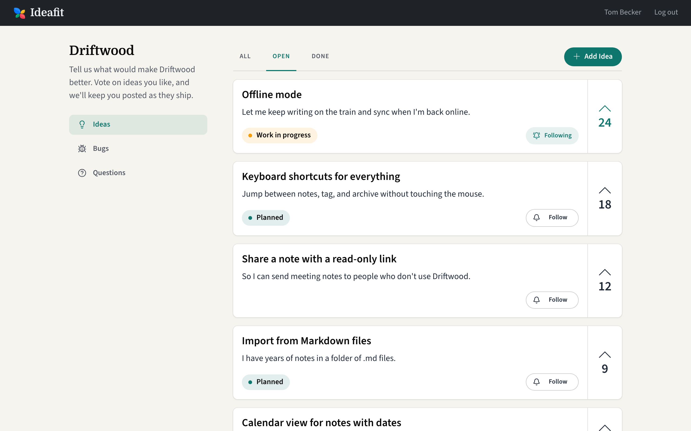
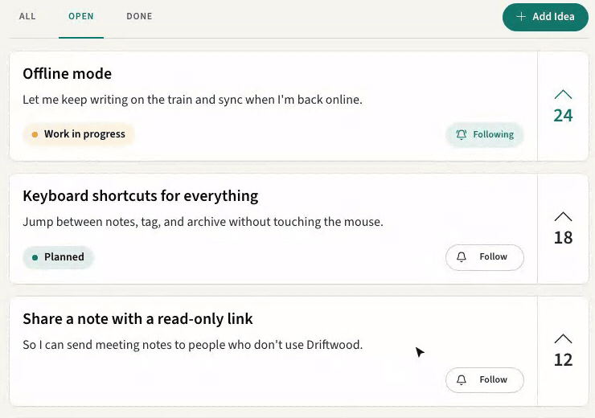
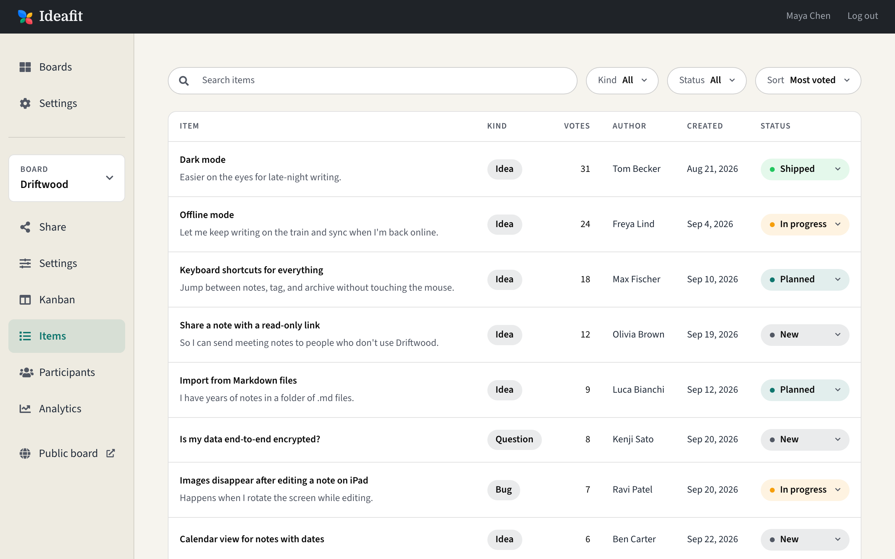
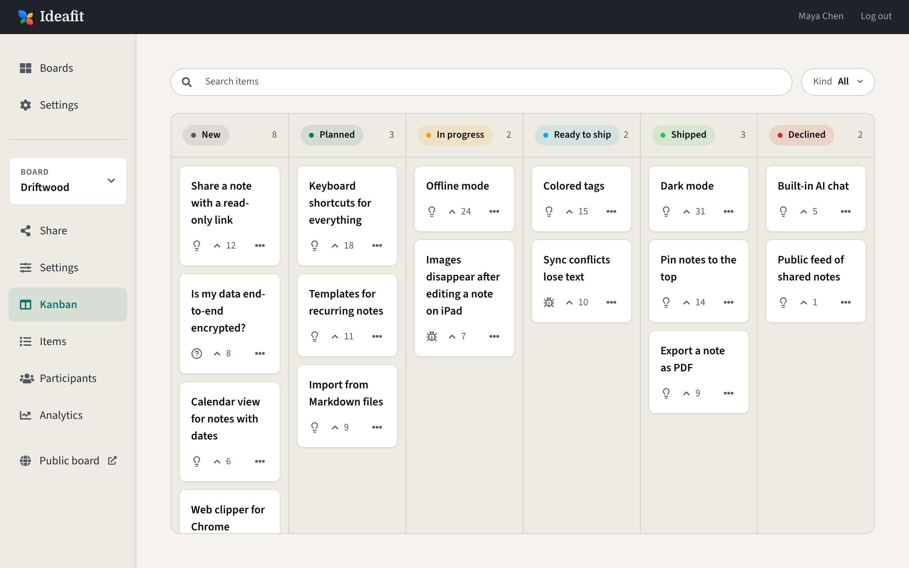
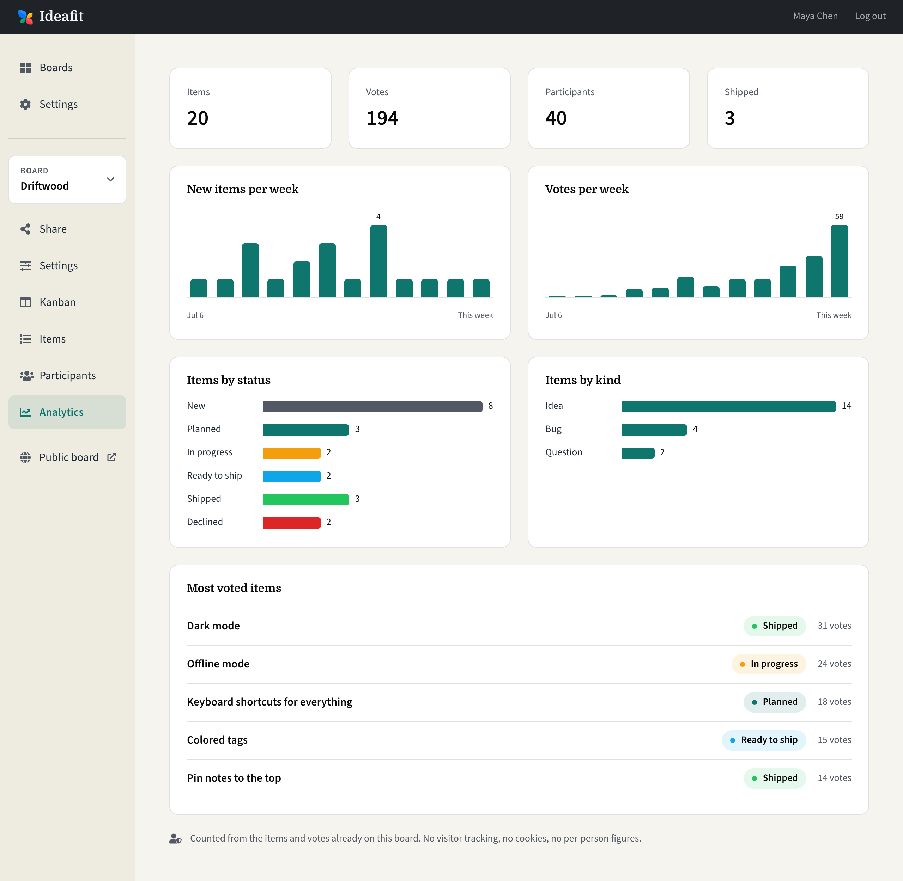
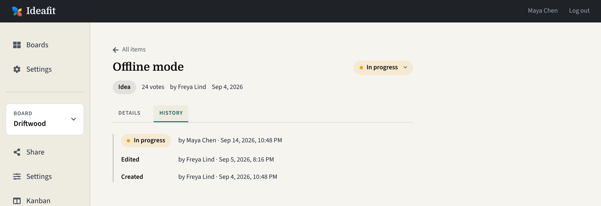
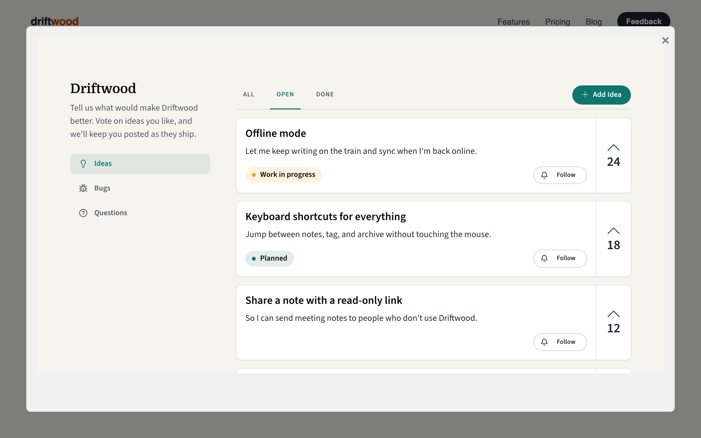

<p align="center">
  
</p>

# Ideafit

[](https://github.com/odosui/ideafit/actions/workflows/ci.yml)
[](https://hub.docker.com/r/hiquest/ideafit)

**Self-hosted open-source feedback boards for your websites.**

Ideafit gives your users one place to suggest ideas, report bugs and ask questions, and to vote on what matters most to them. You triage it all from a simple dashboard, and when something ships, everyone who asked for it gets an email. It runs as a single Docker container with a SQLite file, so there's no database server to manage.



## Features

**For your users**

- Post ideas, bugs and questions, each in its own tab
- Vote on what matters, and see what's planned, in progress and done
- Follow items to get an email when their status changes. Posting or voting follows automatically.
- Sign in with an email link. No passwords.
- Unsubscribe from any email in one click, without signing in

**For your team**

- A dashboard to search, filter and sort everything posted
- A Kanban board: drag items between statuses
- Simple, privacy-friendly analytics: totals, weekly activity, most voted items
- Statuses: New, Planned, In progress, Ready to ship, Shipped, Declined. Declined items drop off the public board.
- A history for every item: who created it, edited it and changed its status
- Email when something new is posted, right away or as a daily digest
- As many boards as you need, each with its own description and color scheme

**For your site**

- A public link for every board
- Embed a board on your own site as a pop-up with one script tag

**For whoever runs it**

- One Docker container and one volume. Back up the volume and you've backed up everything.
- Works without email setup: sign-in links go to the logs until you add SMTP
- MIT licensed

## A quick tour

Voting on an item follows it, and the Follow button toggles email updates:

<p align="center">
  
</p>

The admin dashboard, sorted by votes:



Drag items across a Kanban board as work moves along:



Analytics counted from the items and votes you already have. No visitor tracking, no cookies:



Every item keeps its history:



## Run it

### One click on Railway

[](https://railway.com/deploy/ideafit)

Once it's up, open your service's domain and sign in: the first person to sign in becomes the admin. Until you add SMTP settings, your sign-in link is in the service's Deploy Logs (search for `sign_in`).

### With Docker

```sh
docker run -d --name ideafit -p 3000:80 -v ideafit:/rails/storage hiquest/ideafit
```

Open http://localhost:3000. A demo board lives at http://localhost:3000/b/demo.

All data (a SQLite database and uploads) lives in the `ideafit` volume. Back it up and you've backed up everything.

To configure the public URL, email and admins, grab [`.env.example`](.env.example), fill it in and add `--env-file .env` to the command. Prefer Compose? There's a [`docker-compose.yml`](docker-compose.yml) too.

Sign-in is by email link. Without SMTP settings, the link is printed to `docker logs ideafit`.

The first person to sign in becomes the admin. Admins share and manage all boards; everyone else posts and votes on boards shared with them. To add more admins, list their emails in `ADMIN_EMAILS`.

## Embed

Drop the board into your own site as a pop-up:



```html
<script
  id="ideafit"
  src="https://your-ideafit-host/embed.js"
  data-board="BOARD_ID"
></script>
<button onclick="IdeaFit.show()">Feedback</button>
```

## Develop

```sh
bundle install && npm install
bin/rails db:prepare
bin/dev
```

## License

[MIT](LICENSE)
