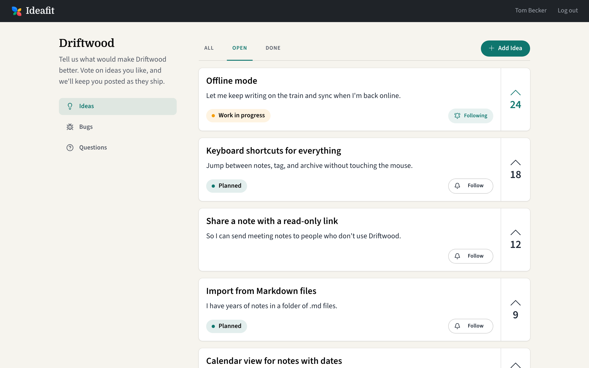
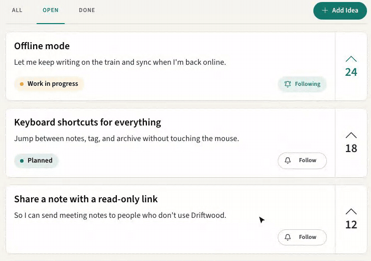
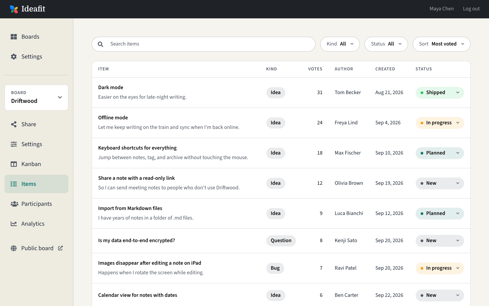
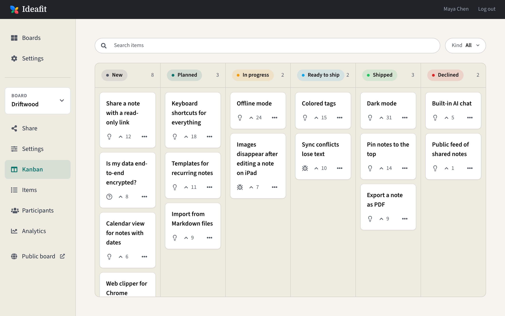
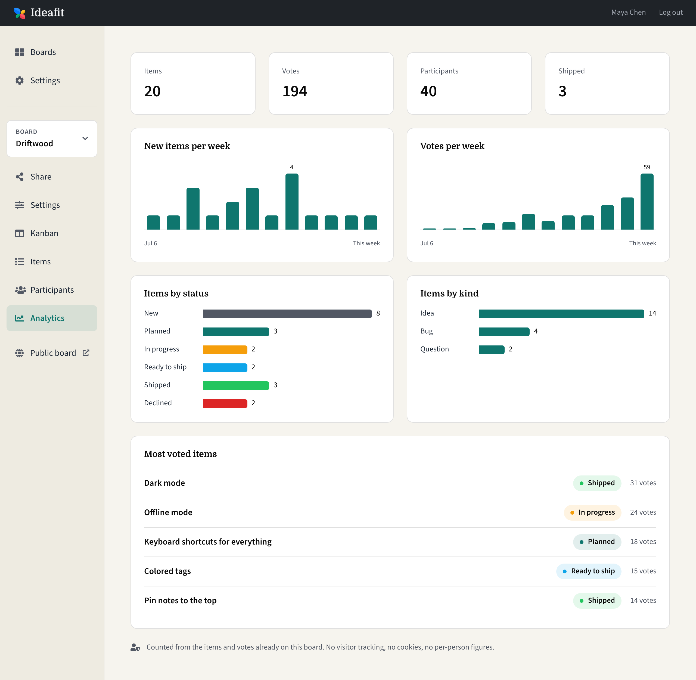
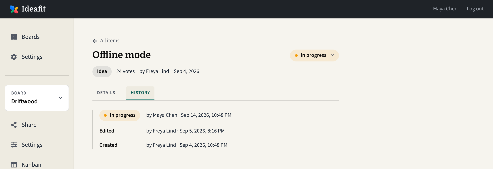
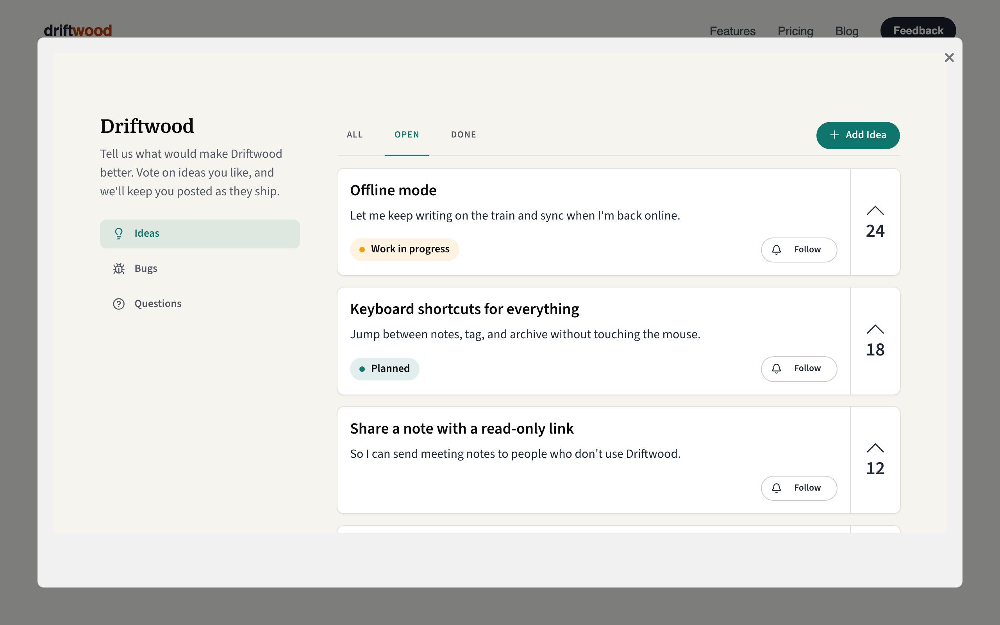

<p align="center">
  
</p>

# Ideafit

[](https://github.com/odosui/ideafit/actions/workflows/ci.yml)
[](https://hub.docker.com/r/hiquest/ideafit)

**Self-hosted open-source feedback boards for your websites.**

Ideafit gives your users one place to suggest ideas, report bugs and ask questions, and to vote on what matters most to them. You triage it all from a simple dashboard, and when something ships, everyone who asked for it gets an email. It runs as a single Docker container with a SQLite file, so there's no database server to manage.



## Features

**For your users**

- Post ideas, bugs and questions, each in its own tab
- Vote, and see what's planned, in progress and done
- Follow items to get an email when their status changes. Posting or voting follows automatically.

**For your team**

- A dashboard to search, filter and sort everything posted
- A Kanban board: drag items between statuses
- Statuses: New, Planned, In progress, Ready to ship, Shipped, Declined. Declined items drop off the public board.
- Simple, privacy-friendly analytics: totals, weekly activity, most voted items
- A history for every item: who created it, edited it and changed its status
- Email when something new is posted, right away or as a daily digest
- As many boards as you need, each with its own description and color scheme
- A public link for every board
- Embed a board on your own site as a pop-up with one script tag
- One Docker container and one volume. Back up the volume and you've backed up everything.
- MIT licensed

## A quick tour

Voting on an item follows it, and the Follow button toggles email updates:

<p align="center">
  
</p>

The admin dashboard, sorted by votes:



Drag items across a Kanban board as work moves along:



Analytics counted from the items and votes you already have. No visitor tracking, no cookies:



Every item keeps its history:



## Run it

### One click on Railway

[](https://railway.com/deploy/ideafit)

Once it's up, open your service's domain and sign in: the first person to sign in becomes the admin. Until you add SMTP settings, your sign-in link is in the service's Deploy Logs (search for `sign_in`).

Railway blocks outgoing SMTP below the Pro plan, so send email through [Mailgun's HTTP API](#email) there instead.

### With Docker

```sh
docker run -d --name ideafit -p 3000:80 -v ideafit:/rails/storage hiquest/ideafit
```

Open http://localhost:3000. A demo board lives at http://localhost:3000/b/demo.

All data (a SQLite database and uploads) lives in the `ideafit` volume. Back it up and you've backed up everything.

To configure the public URL, email and admins, grab [`.env.example`](.env.example), fill it in and add `--env-file .env` to the command. Prefer Compose? There's a [`docker-compose.yml`](docker-compose.yml) too.

Sign-in is by email link. Without SMTP settings, the link is printed to `docker logs ideafit`.

The first person to sign in becomes the admin. Admins share and manage all boards; everyone else posts and votes on boards shared with them. To add more admins, list their emails in `ADMIN_EMAILS`.

## Email

Ideafit sends sign-in links, status updates to followers, and new-item emails to admins. Set `MAIL_FROM` and either:

- SMTP: `SMTP_ADDRESS`, `SMTP_PORT`, `SMTP_USERNAME`, `SMTP_PASSWORD`
- Mailgun's HTTP API, for hosts that block outgoing SMTP: `MAILGUN_API_KEY` (a sending key for the domain), `MAILGUN_DOMAIN`, and `MAILGUN_API_URL=https://api.eu.mailgun.net` if the domain is in Mailgun's EU region. It takes precedence over SMTP.

Without either, emails are written to the log. Emails go out from a background queue that runs inside the web server, so there's no separate worker to run.

## Embed

Drop the board into your own site as a pop-up:



```html
<script
  id="ideafit"
  src="https://your-ideafit-host/embed.js"
  data-board="BOARD_ID"
></script>
<button onclick="IdeaFit.show()">Feedback</button>
```

### Sign your users in

Your users are already signed in on your site, so the widget can sign them in too. Your server signs a short-lived token (a JWT) for the current user with your workspace's signing secret, and the widget passes it to Ideafit. Find the secret, and signing examples for Node, Ruby, Python and PHP, on a board's **Share** page.

The token is signed with HS256 and carries:

| Claim    | Required | What it is                                                                  |
| -------- | -------- | --------------------------------------------------------------------------- |
| `id`     | yes      | Your user's id. Ideafit knows the user by it, never by email.               |
| `exp`    | yes      | Expiry, a Unix time at most 24 hours ahead.                                 |
| `name`   |          | Shown to admins. Cut to 50 characters.                                      |
| `email`  |          | Shown to admins. Emailed only if you [opt in](#email-your-signed-in-users). |
| `avatar` |          | An `https://` image URL.                                                    |

```js
// Node, with jsonwebtoken
const token = jwt.sign(
  { id: user.id, name: user.name, email: user.email },
  process.env.IDEAFIT_SECRET,
  { algorithm: 'HS256', expiresIn: '1h' },
)
```

Render it into the script tag, or hand it over once you have it:

```html
<script id="ideafit" src="https://your-ideafit-host/embed.js" data-board="BOARD_ID" data-token="TOKEN"></script>
```

```js
IdeaFit.identify(token) // null signs the user out of the widget
```

Keep the secret on your server: whoever has it can act as any of your users. Users signed in this way can post, vote and follow on your workspace's boards, and never manage them. Regenerating the secret keeps the previous one working until the next regeneration, so you can update your site without downtime. The secret is encrypted with `SECRET_KEY_BASE`; if you change that, generate a new secret.

### Email your signed-in users

Ideafit can't verify the `email` in the token, so by default it never emails users your site signs in. If your site only passes verified emails, turn on **Email status updates to the address in the token** on a board's **Share** page; it applies to the whole workspace. Set the page on your site that embeds the board too, and emails to those users link there, where they're already signed in, instead of to the board on Ideafit.

Each user is then asked once, the next time they open the board, whether they want these emails; nothing is sent until they say yes. If your site later passes a different email, they're asked again. They can switch emails on or off from the board's sidebar, and every email has links to stop them.

## Import and export

Move a board's items, votes and the people behind them in and out as Ideafit JSON, from the board's **Settings**, or on the command line:

```sh
bin/rails "boards:export[BOARD_ID]" > board.json
bin/rails "boards:import[BOARD_ID]" < board.json
# with Docker: docker exec -i ideafit bin/rails "boards:import[BOARD_ID]" < board.json
```

```json
{
  "format": "ideafit",
  "version": 1,
  "users": [
    { "id": "42", "name": "Ada Lovelace", "email": "ada@example.com", "avatar": "https://example.com/ada.png" }
  ],
  "items": [
    {
      "id": "feature-17",
      "kind": "idea",
      "title": "Dark mode",
      "text": "Easier on the eyes at night",
      "status": "planned",
      "author": "42",
      "created_at": "2025-03-01T12:00:00Z",
      "voters": ["42"]
    }
  ]
}
```

- `users[].id` is your site's user id, the same one you put in the token's `id` claim, so imported people find their votes once your site signs them in. The rest of a user is optional.
- `kind` is `idea`, `bug` or `question`. `status` is `new` (the default), `planned`, `in_progress`, `ready`, `shipped` or `declined`.
- `author` and `voters` refer to users in the file, or to users imported earlier.
- Items keep their `created_at`, and importing sends no emails.
- An import is all or nothing, and names the entry it stopped at. Importing again updates items that have an `id` instead of duplicating them.

## Develop

```sh
bundle install && npm install
bin/rails db:prepare
bin/dev
```

## License

[MIT](LICENSE)
